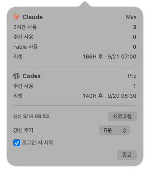

# AIBar

Claude 와 Codex 의 사용량을 macOS 메뉴바 한 줄로 보여주는 앱.

<p></p>

| 자리 | 뜻 |
|---|---|
| `3` | Claude 5시간 창에서 쓴 양 |
| `0` | Claude 주간 창에서 쓴 양 |
| `0` | Claude Fable 모델 주간 쓴 양 |
| `166H` | Claude 주간 창이 리셋되기까지 남은 시간 |
| `1` | Codex 주간 한도에서 쓴 양 |
| `140H` | Codex 주간 창이 리셋되기까지 남은 시간 |

숫자는 전부 **쓴 양**이다. 0 이면 아직 안 썼고 100 이면 다 썼다. `%` 기호는 붙이지 않는다.
리셋까지 한 시간 미만이면 `45M` 처럼 분으로 표시한다.

메뉴바 항목을 누르면 항목별 수치, 리셋 시각, 갱신 주기, 로그인 시 시작 설정이 열린다.

<p></p>

## 설치

[Releases](https://github.com/inxight/aibar/releases/latest) 에서 `AIBar-*.dmg` 를 받아 열고
`AIBar.app` 을 `Applications` 로 끌어다 놓는다. 실행하면 메뉴바에만 뜬다 (Dock 에는 나타나지 않는다).

0.1.1 부터 Developer ID 서명과 Apple 공증을 거쳐 경고 없이 열린다.

0.1.0 은 공증 전 버전이라 처음 열 때 «확인되지 않은 개발자» 경고가 난다. 그 버전을 쓴다면
**시스템 설정 → 개인정보 보호 및 보안** 의 «AIBar 을(를) 열도록 허용» 을 누르거나
`xattr -dr com.apple.quarantine /Applications/AIBar.app` 으로 넘긴다.

## 요구사항

- macOS 14 이상
- Swift 6 (Xcode 26 에 포함)
- 로그인된 [Claude Code](https://claude.com/claude-code) — 사용량 조회에 쓸 자격증명을 여기서 가져온다
- 설치된 `codex` CLI — Codex 사용량 조회에 쓴다

둘 중 하나가 없어도 나머지는 그대로 표시된다. 없는 쪽은 `로그인 필요` 또는 `미설치` 로 나온다.

## 빌드와 실행

```bash
./scripts/build-app.sh      # build/AIBar.app 생성 (이 기계용)
open build/AIBar.app

swift test                  # 파싱·포맷 로직 테스트
```

개발 중에는 `swift build && swift run` 으로도 뜨지만, 로그인 항목 등록은 번들에서만 제대로 동작한다.

## 배포용 DMG 만들기

```bash
./scripts/make-dmg.sh       # build/AIBar-<버전>.dmg (Apple Silicon + Intel)
```

**Gatekeeper 를 통과시키려면 Developer ID 인증서와 공증이 필요하다.** 둘 다 갖춰져 있으면
위 스크립트가 알아서 서명하고 공증까지 하고, 없으면 ad-hoc 서명 상태로 만든다
(그 경우 받는 쪽이 위 «설치» 의 허용 절차를 한 번 거쳐야 한다).

갖추려면 두 가지가 필요하다. 둘 다 Apple Developer Program 멤버십이 있어야 한다.

1. **Developer ID Application 인증서** — Apple Developer 포털에서 발급받아 키체인에 넣는다.
   App Store 용인 `Apple Distribution` 인증서로는 DMG 직접 배포를 서명할 수 없다.
   **계정 소유자(Account Holder)만 발급할 수 있다.** App Store Connect API 키로 요청하면
   `403 This operation can only be performed by the Account Holder` 로 거부된다.
   소유자 Apple ID 로 Xcode → 설정 → Accounts → Manage Certificates → `+` 에서 만든다.
2. **공증 자격증명** — `aibar` 라는 이름으로 키체인에 등록해 둔다. App Store Connect API 키나
   앱 암호 중 하나를 쓴다.

   ```bash
   # API 키
   xcrun notarytool store-credentials aibar \
     --key AuthKey_XXXXXXXXXX.p8 --key-id <키 ID> --issuer <issuer ID>

   # 또는 앱 암호
   xcrun notarytool store-credentials aibar \
     --apple-id <Apple ID> --team-id <팀 ID> --password <앱 암호>
   ```

제대로 됐는지는 만들어진 DMG 안의 앱으로 확인한다. `accepted` 가 나와야 한다.

```bash
spctl -a -vv /Volumes/AIBar/AIBar.app
```

## 어디서 값을 가져오는가

별도 로그인이나 API 키가 필요 없다. 이미 기기에 있는 CLI 인증을 그대로 쓴다.

**Claude** — `~/.claude/.credentials.json` → Keychain(`Claude Code-credentials`) → 환경변수
`CLAUDE_CODE_OAUTH_TOKEN` 순서로 Claude Code 의 OAuth 토큰을 **읽어** `GET https://api.anthropic.com/api/oauth/usage`
를 호출한다. 토큰을 갱신하거나 다시 저장하지 않는다. 토큰이 만료되면 메뉴바에 `토큰 만료` 가 뜨고,
Claude Code 를 한 번 실행하면 Claude Code 가 갱신한 토큰을 다음 조회 때 그대로 읽는다.

**Codex** — `codex -s read-only -a untrusted app-server` 를 띄우고 JSON-RPC 로
`account/rateLimits/read` 를 부른다. 읽기 전용·미신뢰 모드라 이 앱이 파일을 건드리지 않는다.

값은 전부 이 기기에서 제공자에게 직접 간다. 중계 서버도, 수집도 없다.

### Claude 쪽 사용 전에 알아둘 것

Anthropic 문서([Legal and compliance](https://code.claude.com/docs/en/legal-and-compliance))는
구독(Free·Pro·Max) OAuth 인증을 Claude Code 와 Anthropic 자체 앱에서만 쓰도록 하고, 제3자 도구가
Claude 세션 토큰을 수집·저장·중계하는 것을 허용하지 않는다고 적고 있다. 사전 통지 없이 조치할 수
있다는 문구도 있다.

이 앱은 토큰을 사용량 조회에만 쓰고 저장·갱신·외부 전송을 하지 않지만, **토큰을 읽어 쓰는 것
자체가 위 문구에 해당할 수 있다.** 해당 기능이 막히거나 계정에 조치가 들어올 가능성은 사용자 본인이
판단해야 한다. Codex 쪽은 이 고지와 관계없이 동작한다.

## 구현에서 주의한 곳

응답 형태를 실제로 호출해 확인한 결과(2026-09-13), 곧이곧대로 읽으면 틀리는 자리가 두 군데 있었다.

**Fable 사용량은 전용 필드에 없다.** `seven_day_opus` 같은 모델별 필드는 전부 `null` 로 내려오고,
Fable 수치는 `limits[]` 배열 안에 `kind: "weekly_scoped"` 이고
`scope.model.display_name == "Fable"` 인 항목의 `percent` 로만 들어 있다.

**Codex 의 `primary` 가 항상 5시간 창인 것은 아니다.** 실측한 계정에서는 `primary` 가
주간(`windowDurationMins: 10080`)이고 `secondary` 는 `null` 이었다. 그래서 위치가 아니라
창 길이로 주간 창을 골라낸다.

## 로고

런타임 SVG 파서를 들고 다니지 않으려고, 원본 SVG 를 미리 Swift 벡터 데이터로 바꿔
`Sources/AIBar/BrandPaths.swift` 에 넣어 두었다. 원본을 바꿨다면 다시 생성한다.

```bash
python3 scripts/svg2swift.py Resources/logos/claude.svg Resources/logos/openai.svg \
  > Sources/AIBar/BrandPaths.swift
```

## 라이선스와 상표

소스 코드는 [MIT](LICENSE) 로 배포한다.

Claude 는 Anthropic PBC, OpenAI 와 Codex 는 OpenAI 의 상표다. 로고 SVG 데이터는
[simple-icons](https://github.com/simple-icons/simple-icons) 에서 가져왔는데, 그 CC0 표시는 파일에 대한
것이지 **상표를 써도 된다는 허락이 아니다.** MIT 라이선스도 상표에는 적용되지 않는다.

이 프로젝트는 Anthropic·OpenAI 와 관계가 없으며, 두 회사가 만들거나 승인·후원한 것이 아니다.
